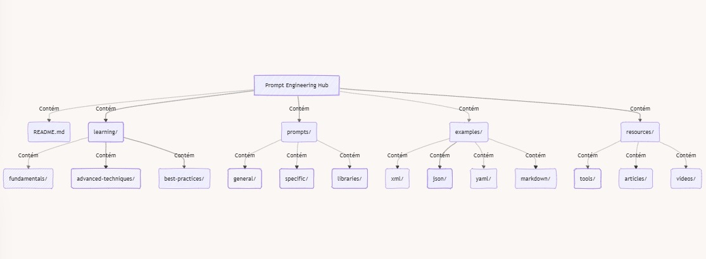

# 🚀 Prompt Engineering Hub

> Elevando a arte e a ciência da interação com IA

Bem-vindo ao **BeyondLabs - Prompt Engineering**, Este repositório é uma fonte abrangente de conhecimento, ferramentas e recursos para otimizar suas interações com IA e desbloquear todo o potencial da tecnologia de linguagem natural.

## 🌟 O que é Prompt Engineering?

Prompt Engineering é a prática sofisticada de projetar, refinar e otimizar instruções (prompts) para modelos de linguagem de IA. Vai muito além de simplesmente formular perguntas; é uma disciplina que combina criatividade, lógica e compreensão profunda dos modelos de IA para:

- 🎯 Obter respostas mais precisas e relevantes
- 💡 Estimular a criatividade e inovação nas saídas da IA
- 🛠️ Resolver problemas complexos de forma mais eficiente
- 🚀 Melhorar o desempenho em uma ampla gama de tarefas

## 🗺️ Navegando pelo Repositório

Nossa estrutura é projetada para fornecer uma experiência de aprendizado e uso intuitiva:

- 📚 **learning/**: Mergulhe fundo nos fundamentos, técnicas avançadas e melhores práticas.
- 💬 **prompts/**: Explore nossa coleção curada de prompts eficazes para várias aplicações.
- 🧪 **examples/**: Veja prompts em ação com exemplos em vários formatos (XML, JSON, YAML, Markdown).
- 🛠️ **resources/**: Descubra ferramentas, artigos e vídeos para aprimorar suas habilidades.

## 🤝 Como Contribuir

Sua experiência e insights são valiosos! Aqui estão algumas maneiras de contribuir:

1. 🍴 Faça um fork do repositório
2. 🔧 Crie uma branch para sua feature (`git checkout -b feature/AmazingFeature`)
3. 💡 Adicione seus prompts, exemplos ou recursos
4. 📝 Faça commit das suas mudanças (`git commit -m 'Add some AmazingFeature'`)
5. 🚀 Faça push para a branch (`git push origin feature/AmazingFeature`)
6. 🔍 Abra um Pull Request

Para diretrizes detalhadas, confira nosso [Guia de Contribuição](CONTRIBUTING.md).

## 📜 Licença

Distribuído sob a Licença MIT. Veja `LICENSE` para mais informações.

⭐️ Se este repositório foi útil para você, considere dar uma estrela!