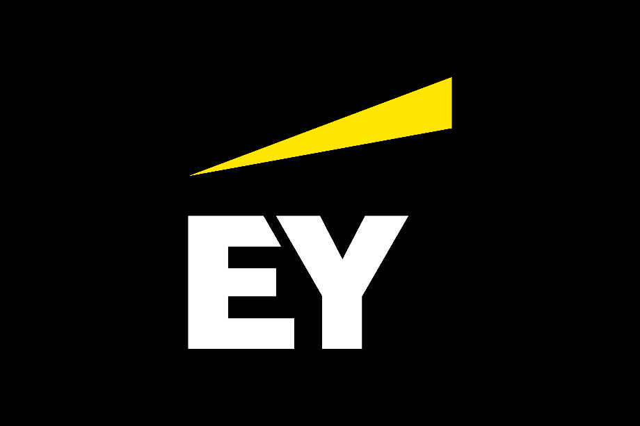

  <h1 style="font-size: 3em; 
              color: #D69E2E;">🚧 754 - Página em Construção! 🚧</h1>
  
Obrigado por visitar! Estamos trabalhando para trazer conteúdos incríveis sobre 
            <strong>Prompt Engineering</strong>! ⏳

  
Agradecemos seu interesse em aprender e evoluir com a gente. 🙌

  

    
  

  <a href="https://github.com/EYLatamSouth/beyondlabs-prompt-engineering" 
      style="color: #D69E2E; 
              text-decoration: none; 
              font-size: 1.2em;">Sobre este Projeto</a> | 
  <a href="https://github.com/EYLatamSouth/beyondlabs-prompt-engineering/blob/main/LICENSE" 
      style="color: #D69E2E; 
              text-decoration: none; 
              font-size: 1.2em;">Licença</a>

