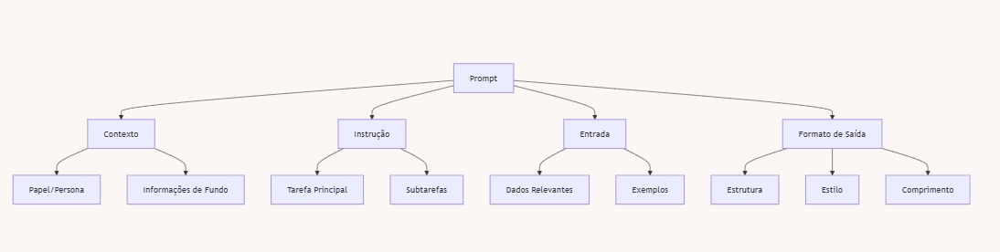

# Introdução ao Prompt Engineering

## Índice
- [Introdução ao Prompt Engineering](#introdução-ao-prompt-engineering)
  - [Índice](#índice)
  - [O que é Prompt Engineering?](#o-que-é-prompt-engineering)
  - [Por que o Prompt Engineering é importante?](#por-que-o-prompt-engineering-é-importante)
  - [Exemplo prático: A diferença que um bom prompt faz](#exemplo-prático-a-diferença-que-um-bom-prompt-faz)
    - [Prompt 1 (Básico):](#prompt-1-básico)
    - [Prompt 2 (Engenharia de Prompt):](#prompt-2-engenharia-de-prompt)
    - [Análise da diferença:](#análise-da-diferença)
  - [Princípios fundamentais do Prompt Engineering](#princípios-fundamentais-do-prompt-engineering)
  - [Conclusão](#conclusão)
  - [Navegação](#navegação)
  - [Tópicos Relacionados](#tópicos-relacionados)
  - [Contribuição](#contribuição)

## O que é Prompt Engineering?

Prompt Engineering é a arte e a ciência de projetar instruções eficazes para modelos de linguagem de IA, com o objetivo de obter respostas mais precisas, relevantes e úteis. É uma disciplina que combina criatividade, lógica e compreensão profunda do funcionamento dos modelos de IA.

## Por que o Prompt Engineering é importante?

1. **Melhora a precisão**: Prompts bem elaborados podem reduzir significativamente erros e inconsistências nas respostas da IA.
2. **Aumenta a eficiência**: Com prompts otimizados, você pode obter as informações desejadas mais rapidamente, economizando tempo e recursos computacionais.
3. **Expande as capacidades**: Prompt Engineering permite que você aproveite todo o potencial dos modelos de IA, realizando tarefas complexas que vão além de simples perguntas e respostas.
4. **Personalização**: Permite adaptar o comportamento do modelo às necessidades específicas de cada usuário ou aplicação.

## Exemplo prático: A diferença que um bom prompt faz

Vamos comparar dois prompts diferentes para a mesma tarefa: resumir um artigo sobre mudanças climáticas.

### Prompt 1 (Básico):
```
Resuma este artigo sobre mudanças climáticas.
```

### Prompt 2 (Engenharia de Prompt):
```
Você é um especialista em ciências ambientais com vasta experiência em mudanças climáticas. Por favor, forneça um resumo conciso do artigo a seguir, destacando:
1. As principais causas das mudanças climáticas mencionadas
2. Os impactos mais significativos discutidos
3. As soluções propostas, se houver
4. Quaisquer dados estatísticos relevantes

Limite seu resumo a 250 palavras e use linguagem acessível para um público não especializado.
```

### Análise da diferença:

O Prompt 1 é vago e não fornece diretrizes específicas. Isso pode resultar em um resumo genérico que não captura os pontos mais importantes do artigo.

O Prompt 2, por outro lado:
- Estabelece um contexto (especialista em ciências ambientais)
- Fornece uma estrutura clara para o resumo
- Especifica o comprimento desejado
- Define o público-alvo

Como resultado, o Prompt 2 tem muito mais probabilidade de gerar um resumo informativo, bem estruturado e adaptado às necessidades do usuário.

## Princípios fundamentais do Prompt Engineering

1. **Clareza**: Seja específico e direto em suas instruções.
2. **Contexto**: Forneça informações de fundo relevantes.
3. **Estrutura**: Organize seu prompt de forma lógica.
4. **Especificidade**: Detalhe exatamente o que você espera na resposta.
5. **Iteração**: Esteja preparado para refinar seus prompts com base nos resultados.



## Conclusão

O Prompt Engineering é uma habilidade crucial na era da IA. Dominar essa disciplina permite que você extraia o máximo valor dos modelos de linguagem, transformando-os em ferramentas poderosas e precisas para uma ampla gama de aplicações. Nos próximos capítulos, exploraremos cada aspecto do Prompt Engineering em detalhes, fornecendo exemplos práticos e técnicas avançadas para aprimorar suas habilidades.

## Navegação

- [Próximo: Estrutura Básica de Prompts](02_basic_prompt_structure.md)

## Tópicos Relacionados

- [Estrutura Básica de Prompts](02_basic_prompt_structure.md)
- [Tipos de Prompts](03_types_of_prompts.md)
- [Contexto e Especificidade](04_context_and_specificity.md)
- [Componentes do Prompt](05_prompt_components.md)
- [Erros comuns em Prompts](06_common_pitfalls.md)
- [Testes e iteração de Prompt](07_prompt_testing_and_iteration.md)
- [Considerações Éticas em Engenhência de Prompt](08_ethical_considerations.md)

## Contribuição

Encontrou um erro ou tem uma sugestão? Por favor, abra uma [issue](https://github.com/EYLatamSouth/beyondlabs-prompt-engineering/issues) ou envie um [pull request](https://github.com/EYLatamSouth/beyondlabs-prompt-engineering/pulls).

---

<div align="center">
  <a href="#índice">Voltar ao Índice</a> |
  <a href="https://github.com/EYLatamSouth/beyondlabs-prompt-engineering">Sobre este Projeto</a> | 
  <a href="https://github.com/EYLatamSouth/beyondlabs-prompt-engineering/blob/main/LICENSE">Licença</a>
</div>