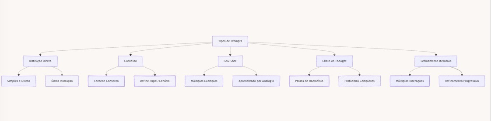

# Tipos de Prompts em Engenharia de Prompt

## Introdução

A Engenharia de Prompt é uma disciplina em rápida evolução que se tornou fundamental para otimizar o desempenho de modelos de linguagem de IA. Neste capítulo, exploraremos os principais tipos de prompts utilizados nesta prática. Compreender esses diferentes tipos não apenas ampliará seu repertório técnico, mas também o capacitará a escolher a abordagem mais eficaz para cada situação específica.

Os prompts são as instruções ou consultas que fornecemos aos modelos de IA para obter as respostas desejadas. A forma como estruturamos esses prompts pode influenciar significativamente a qualidade, precisão e relevância das respostas geradas. Vamos mergulhar nos cinco tipos principais de prompts, examinando suas características, aplicações e melhores práticas.

## 1. Prompts de Instrução Direta

Descrição: Estes são os prompts mais simples e diretos, que fornecem uma instrução clara para o modelo seguir.
### Exemplo:
```markdown
PROMPT:
Traduza as seguintes frases para o Russo:

1. "The cat is on the table."
2. "Good morning, how are you? How is your day going? Do you need help? What is your name?"

OUTPUT:
1. "Кот на столе."
2. "Доброе утро, как вы? Как проходит ваш день? Вам нужна помощь? Как вас зовут?"
```

**Quando usar:** Ideal para tarefas simples e diretas onde você precisa de uma resposta específica.

**Técnica: Instruction Following** <br>
Esta técnica envolve dar instruções claras e concisas ao modelo.

**Caso de Uso Real:** Tradução automática em um aplicativo de mensagens.

**Dica de Otimização:** Use verbos de ação claros no início da instrução para maior eficácia.

## 2. Prompts de Contexto

Descrição: Estes prompts fornecem informações de fundo ou contexto antes de fazer uma pergunta ou dar uma instrução.

### Exemplo:
```markdown
PROMPT:
Contexto: Você é um especialista em história medieval europeia.
Pergunta: Quais foram os principais fatores que levaram ao início da Guerra dos Cem Anos?

OUTPUT:
Os principais fatores que levaram ao início da Guerra dos Cem Anos (1337-1453) incluem:

1. Disputa sucessória: Eduardo III da Inglaterra reivindicava o trono francês.
2. Conflitos territoriais: Disputas sobre o controle da Guiana.
3. Interesses econômicos: Competição pelo controle do comércio na Flandres.
4. Alianças políticas: Tensões entre Inglaterra e Escócia, aliada da França.
5. Mudanças sociais: Declínio do sistema feudal e ascensão de exércitos profissionais.
```

**Quando usar:** Útil quando você precisa que o modelo assuma um papel específico ou considere informações particulares ao responder.

**Técnica: Role Prompt** <br>
Esta técnica envolve atribuir um papel ou persona específica ao modelo para influenciar suas respostas.

**Caso de Uso Real:** Chatbots de atendimento ao cliente personalizados por setor.

**Dica de Otimização:** Forneça contexto relevante e conciso, evitando informações desnecessárias que possam confundir o modelo.

## 3. Prompts de Poucos Exemplos (Few-Shot)

Descrição: Estes prompts fornecem alguns exemplos da tarefa desejada antes de solicitar que o modelo execute a mesma tarefa com novos dados.

### Exemplo:
```markdown
<prompt>
  <context>
    Classifique os seguintes comentários como positivos ou negativos:
  </context>
  
  <examples>
    <example>
      <input>Este filme foi incrível, adorei cada minuto!</input>
      <output>Positivo</output>
    </example>
    <example>
      <input>Não gostei do atendimento, muito demorado.</input>
      <output>Negativo</output>
    </example>
  </examples>
  
  <task>
    Agora, classifique este comentário:
    "O produto chegou com defeito, mas o suporte foi muito prestativo."
  </task>
</prompt>

OUTPUT:
Misto (ou Positivo e Negativo)

Explicação: O comentário contém um aspecto negativo (produto com defeito) e um positivo (bom suporte), tornando-o uma avaliação mista.
```

**Quando usar:** Eficaz para tarefas de classificação, geração de texto em um estilo específico, ou quando você quer que o modelo siga um padrão particular.

**Técnica: Few-Shot Learning** <br>
Esta técnica envolve fornecer alguns exemplos para o modelo aprender e seguir o padrão.

**Caso de Uso Real:** Classificação de sentimentos em análises de produtos em um e-commerce.

**Dica de Otimização:** Use exemplos diversificados que cubram diferentes nuances da tarefa para melhorar a generalização.

## 4. Prompts de Cadeia de Pensamento (Chain-of-Thought)

Descrição: Estes prompts orientam o modelo através de uma série de etapas de raciocínio para chegar a uma conclusão ou solução.

### Exemplo:
```markdown
PROMPT:
Resolva o seguinte problema, mostrando seu raciocínio passo a passo:

Um trem parte da estação A às 8:00 da manhã, viajando a 60 km/h. Duas horas depois, outro trem parte da mesma estação na mesma direção, viajando a 80 km/h. A que horas o segundo trem alcançará o primeiro?

OUTPUT:
Vamos resolver este problema passo a passo:

1. Entendendo os dados:
   - Trem 1: parte às 8:00, velocidade de 60 km/h
   - Trem 2: parte às 10:00 (2 horas depois), velocidade de 80 km/h

2. Calculando a distância percorrida pelo Trem 1 quando o Trem 2 parte:
   - Tempo: 2 horas
   - Distância = Velocidade × Tempo
   - Distância = 60 km/h × 2 h = 120 km

3. Calculando a diferença de velocidade:
   - Diferença = Velocidade do Trem 2 - Velocidade do Trem 1
   - Diferença = 80 km/h - 60 km/h = 20 km/h

4. Calculando o tempo necessário para o Trem 2 alcançar o Trem 1:
   - Tempo = Distância ÷ Diferença de Velocidade
   - Tempo = 120 km ÷ 20 km/h = 6 horas

5. Determinando a hora em que o Trem 2 alcançará o Trem 1:
   - Hora de partida do Trem 2: 10:00
   - Tempo para alcançar: 6 horas
   - Hora de alcance: 10:00 + 6 horas = 16:00 (4:00 da tarde)

Portanto, o segundo trem alcançará o primeiro às 16:00 (4:00 da tarde).
```

**Quando usar:** Ideal para problemas complexos que requerem múltiplas etapas de raciocínio, como problemas matemáticos, lógicos ou de análise.

**Técnica: Chain-of-Thought Prompting** <br>
Esta técnica envolve guiar o modelo através de etapas de raciocínio para chegar a uma conclusão.

**Caso de Uso Real:** Sistema de suporte para diagnóstico médico.

**Dica de Otimização:** Divida problemas complexos em etapas lógicas e sequenciais, guiando o modelo através do processo de raciocínio.

## 5. Prompts de Refinamento Iterativo

Descrição: Estes prompts envolvem uma série de interações, onde cada prompt subsequente refina ou expande o resultado anterior.

### Exemplo:
```markdown
PROMPT 1:
Escreva um breve parágrafo sobre os benefícios da meditação.

OUTPUT 1:
A meditação oferece numerosos benefícios para a saúde mental e física. Ela pode reduzir o estresse, melhorar a concentração e promover o bem-estar emocional. Praticar meditação regularmente também pode ajudar a diminuir a ansiedade, melhorar a qualidade do sono e aumentar a autoconsciência.

PROMPT 2:
Ótimo. Agora, expanda esse parágrafo, incluindo alguns benefícios físicos específicos da meditação.

OUTPUT 2:
A meditação oferece numerosos benefícios para a saúde mental e física. Ela pode reduzir o estresse, melhorar a concentração e promover o bem-estar emocional. Praticar meditação regularmente também pode ajudar a diminuir a ansiedade, melhorar a qualidade do sono e aumentar a autoconsciência. Além disso, a meditação tem demonstrado benefícios físicos significativos. Estudos indicam que pode baixar a pressão arterial, fortalecer o sistema imunológico e reduzir a inflamação crônica no corpo. Alguns praticantes relatam alívio de dores crônicas e melhora na função digestiva. A meditação também pode aumentar a produção de melatonina, ajudando a regular o ciclo de sono-vigília.

PROMPT 3:
Excelente. Para finalizar, adicione uma breve conclusão sobre como incorporar a meditação na rotina diária.

OUTPUT 3:
[O parágrafo anterior, seguido de:]

Incorporar a meditação na rotina diária não precisa ser complicado. Começar com apenas cinco minutos por dia, preferencialmente no mesmo horário, pode estabelecer um hábito sólido. Muitos encontram benefício em meditar logo ao acordar ou antes de dormir. Aplicativos de meditação guiada, aulas online ou grupos locais podem fornecer estrutura e suporte para iniciantes. Com prática consistente, os benefícios da meditação podem se acumular, levando a melhorias significativas na qualidade de vida geral.
```

**Quando usar:** Útil para tarefas de escrita criativa, desenvolvimento de ideias ou quando você precisa de uma resposta mais elaborada e refinada.

**Técnica: Iterative Refinement** <br>
Esta técnica envolve refinar progressivamente o output através de múltiplas interações.

**Caso de Uso Real:** Assistente de escrita para criação de conteúdo de marketing.

**Dica de Otimização:** Comece com instruções gerais e progressivamente adicione detalhes específicos em cada iteração.

## Comparação Visual dos Tipos de Prompts

Para facilitar a compreensão das diferenças entre os tipos de prompts, vamos visualizá-los em um diagrama comparativo:



### Conclusão
Compreender e aplicar efetivamente diferentes tipos de prompts é uma habilidade crucial em Engenharia de Prompt. Cada tipo tem suas forças e é adequado para diferentes situações. Experimentar com vários tipos de prompts e combiná-los criativamente pode levar a resultados mais precisos e úteis em uma ampla gama de aplicações de IA.
Lembre-se, a escolha do tipo de prompt deve ser guiada pelo contexto específico, a complexidade da tarefa e o resultado desejado. Praticar com diferentes tipos de prompts ajudará você a desenvolver intuição sobre qual abordagem funciona melhor para cada situação.