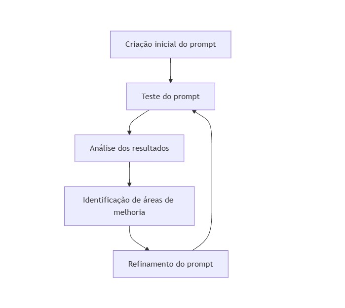

# Testes e Iteração de Prompt

## Índice
- [Testes e Iteração de Prompt](#testes-e-iteração-de-prompt)
  - [Índice](#índice)
  - [Introdução](#introdução)
  - [1. Importância dos Testes de Prompt](#1-importância-dos-testes-de-prompt)
  - [2. Metodologias de Teste](#2-metodologias-de-teste)
    - [2.1 Testes A/B](#21-testes-ab)
    - [2.2 Avaliação Qualitativa](#22-avaliação-qualitativa)
    - [2.3 Métricas Quantitativas](#23-métricas-quantitativas)
  - [3. Processo de Iteração](#3-processo-de-iteração)
  - [4. Ferramentas e Técnicas](#4-ferramentas-e-técnicas)
  - [5. Estudo de Caso](#5-estudo-de-caso)
  - [6. Melhores Práticas](#6-melhores-práticas)
  - [Conclusão](#conclusão)
  - [Navegação](#navegação)
  - [Tópicos Relacionados](#tópicos-relacionados)
  - [Contribuição](#contribuição)

## Introdução

O teste e a iteração de prompts são componentes cruciais da Engenharia de Prompt. Esses processos permitem refinar e otimizar os prompts para obter os melhores resultados possíveis dos modelos de linguagem. Neste capítulo, exploraremos as metodologias, ferramentas e melhores práticas para testar e iterar prompts efetivamente.

## 1. Importância dos Testes de Prompt

Testar prompts é essencial por várias razões:

1. **Qualidade da saída**: Garante que o prompt gere respostas precisas e relevantes.
2. **Consistência**: Assegura que o prompt produza resultados consistentes em diferentes execuções.
3. **Eficiência**: Ajuda a identificar e corrigir problemas de desempenho.
4. **Adaptabilidade**: Permite ajustar o prompt para diferentes cenários ou públicos-alvo.

## 2. Metodologias de Teste

### 2.1 Testes A/B

Os testes A/B envolvem comparar duas versões de um prompt para determinar qual produz melhores resultados.

**Exemplo**:

Versão A:
```
Resuma o seguinte texto em 3 pontos principais.
```

Versão B:
```
Analise o texto a seguir e extraia os 3 conceitos mais importantes, apresentando-os em forma de lista com marcadores.
```

### 2.2 Avaliação Qualitativa

A avaliação qualitativa envolve a revisão manual das respostas geradas pelo modelo para avaliar sua qualidade, relevância e adequação.

**Critérios de avaliação**:
- Precisão da informação
- Relevância para o contexto
- Clareza e coesão
- Aderência às instruções do prompt

### 2.3 Métricas Quantitativas

Métricas quantitativas fornecem dados mensuráveis sobre o desempenho do prompt.

**Exemplos de métricas**:
- Taxa de conclusão bem-sucedida
- Tempo de resposta
- Similaridade com respostas de referência (usando métricas como BLEU ou ROUGE)
- Diversidade lexical (usando métricas como TTR - Type-Token Ratio)

## 3. Processo de Iteração

O processo de iteração envolve refinar continuamente o prompt com base nos resultados dos testes. Aqui está um fluxo típico:

1. **Criação inicial do prompt**
2. **Teste do prompt**
3. **Análise dos resultados**
4. **Identificação de áreas de melhoria**
5. **Refinamento do prompt**
6. **Repetição do processo**

**Diagrama de Fluxo**:



## 4. Ferramentas e Técnicas

Várias ferramentas e técnicas podem auxiliar no processo de teste e iteração:

1. **Plataformas de teste de prompt**: Como GPT-3.5 Playground, Anthropic's Claude, ou ferramentas personalizadas.
2. **Frameworks de avaliação**: Como ROUGE para avaliação de resumos ou BLEU para tradução.
3. **Análise de sentimento**: Para avaliar o tom e a emoção das respostas geradas.
4. **Visualização de dados**: Para representar graficamente os resultados dos testes.

## 5. Estudo de Caso

Vamos considerar um exemplo prático de teste e iteração de prompt para um assistente de atendimento ao cliente:

**Prompt Inicial**:
```
Você é um assistente de atendimento ao cliente. Responda à seguinte pergunta do cliente.
```

**Resultado**: Respostas genéricas e pouco personalizadas.

**Iteração 1**:
```
Você é um assistente de atendimento ao cliente para uma loja de eletrônicos. Responda à seguinte pergunta do cliente de forma educada e informativa.
```

**Resultado**: Melhoria na relevância, mas ainda falta especificidade.

**Iteração 2**:
```
Você é Sarah, uma assistente de atendimento ao cliente experiente para a TechMart, uma loja de eletrônicos premium. Responda à seguinte pergunta do cliente de forma educada, informativa e empática. Ofereça soluções específicas e, se apropriado, sugira produtos relevantes da nossa loja.
```

**Resultado**: Respostas mais personalizadas, informativas e alinhadas com a marca.

## 6. Melhores Práticas

1. **Teste regularmente**: Faça testes frequentes, especialmente após mudanças significativas.
2. **Varie os cenários de teste**: Use uma variedade de entradas para testar diferentes aspectos do prompt.
3. **Mantenha um registro**: Documente todas as iterações e seus resultados.
4. **Envolva os usuários finais**: Quando possível, obtenha feedback dos usuários reais.
5. **Considere o contexto**: Lembre-se de testar o prompt em diferentes contextos ou com diferentes perfis de usuário.
6. **Automatize quando possível**: Use scripts ou ferramentas para automatizar partes do processo de teste.

## Conclusão

O teste e a iteração de prompts são processos contínuos e essenciais na Engenharia de Prompt. Através de testes rigorosos e iterações cuidadosas, é possível criar prompts altamente eficazes que maximizam o potencial dos modelos de linguagem. Lembre-se de que a perfeição é um alvo móvel - à medida que os modelos e as necessidades evoluem, seus prompts também devem evoluir.

## Navegação
- [Anterior: Erros Comuns em Prompts](06_common_pitfalls.md)
- [Próximo: Considerações Éticas em Engenharia de Prompt](08_ethical_considerations.md)

## Tópicos Relacionados
- [Introdução à Engenharia de Prompt](01_introduction_to_prompt_engineering.md)
- [Estrutura Básica de Prompts](02_basic_prompt_structure.md)
- [Tipos de Prompts](03_types_of_prompts.md)
- [Contexto e Especificidade](04_context_and_specificity.md)
- [Componentes do Prompt](05_prompt_components.md)
- [Erros Comuns em Prompts](06_common_pitfalls.md)
- [Considerações Éticas em Engenharia de Prompt](08_ethical_considerations.md)

## Contribuição

Encontrou um erro ou tem uma sugestão? Por favor, abra uma [issue](https://github.com/EYLatamSouth/beyondlabs-prompt-engineering/issues) ou envie um [pull request](https://github.com/EYLatamSouth/beyondlabs-prompt-engineering/pulls).

---

<div align="center">
  <a href="#índice">Voltar ao Índice</a> |
  <a href="https://github.com/EYLatamSouth/beyondlabs-prompt-engineering">Sobre este Projeto</a> | 
  <a href="https://github.com/EYLatamSouth/beyondlabs-prompt-engineering/blob/main/LICENSE">Licença</a>
</div>